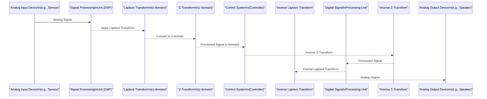
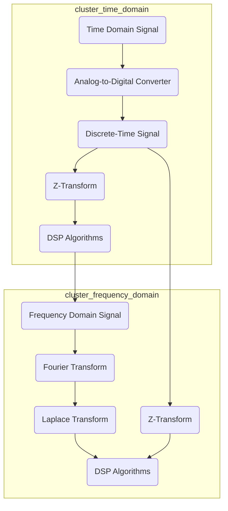

```mermaid
sequenceDiagram
  participant AnalogInput as "Analog Input Device\n(e.g., Sensor)"
  participant SignalProcessing as "Signal Processing\nUnit (DSP)"
  participant LaplaceTransform as "Laplace Transform\n(s-domain)"
  participant ZTransform as "Z-Transform\n(z-domain)"
  participant ControlSystem as "Control System\n(Controller)"
  participant InverseLaplace as "Inverse Laplace Transform"
  participant DigitalProcessing as "Digital Signal\nProcessing Unit"
  participant InverseZTransform as "Inverse Z-Transform"
  participant AnalogOutput as "Analog Output Device\n(e.g., Speaker)"

  AnalogInput->>SignalProcessing: Analog Signal
  SignalProcessing-->>LaplaceTransform: Apply Laplace Transform
  LaplaceTransform-->>ZTransform: Convert to z-domain
  ZTransform-->>ControlSystem: Processed Signal (z-domain)
  ControlSystem-->>InverseZTransform: Inverse Z-Transform
  InverseZTransform-->>DigitalProcessing: Processed Signal
  DigitalProcessing-->>InverseLaplace: Inverse Laplace Transform
  InverseLaplace-->>AnalogOutput: Analog Output
```

```mermaid
graph TD;
    subgraph cluster_time_domain
        tdSignal(Time Domain Signal)
        A2D(Analog-to-Digital Converter)
        dtSignal(Discrete-Time Signal)
        ZT(Z-Transform)
        DSPAlgorithms(DSP Algorithms)
    end

    subgraph cluster_frequency_domain
        fdSignal(Frequency Domain Signal)
        FourierT(Fourier Transform)
        LT(Laplace Transform)
        ZT2(Z-Transform)
        DSPAlgorithms2(DSP Algorithms)
    end

    tdSignal --> A2D --> dtSignal --> ZT --> DSPAlgorithms
    DSPAlgorithms --> fdSignal

    fdSignal --> FourierT --> LT --> DSPAlgorithms2
    dtSignal --> ZT2 --> DSPAlgorithms2
```
